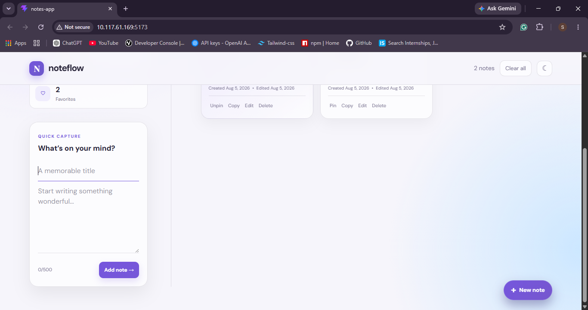
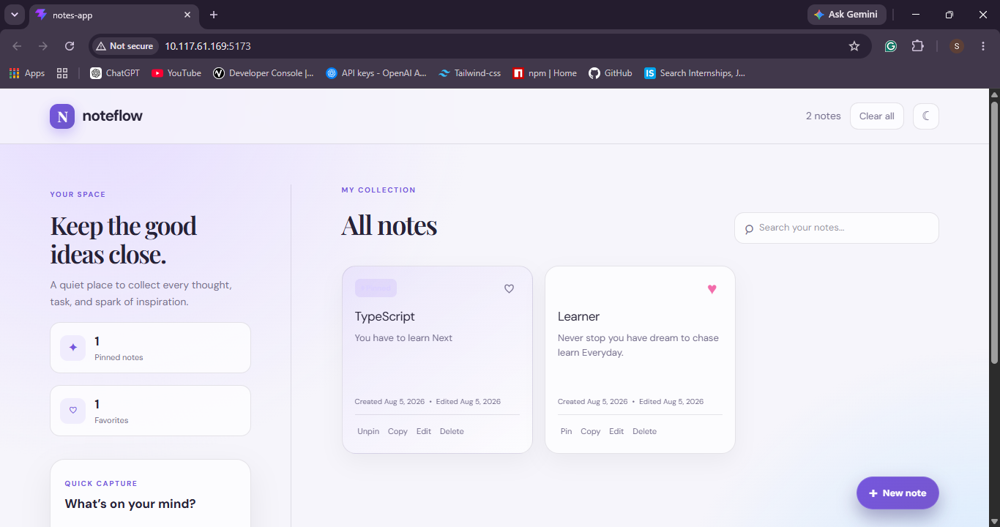
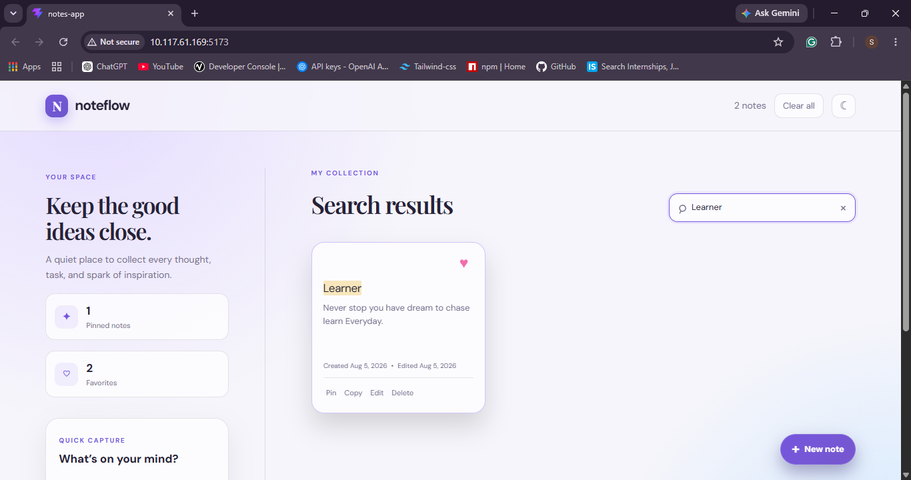
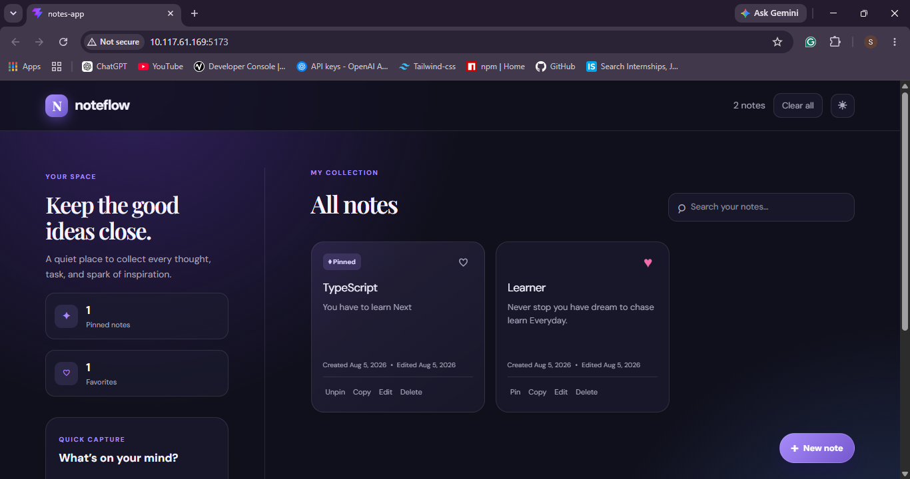
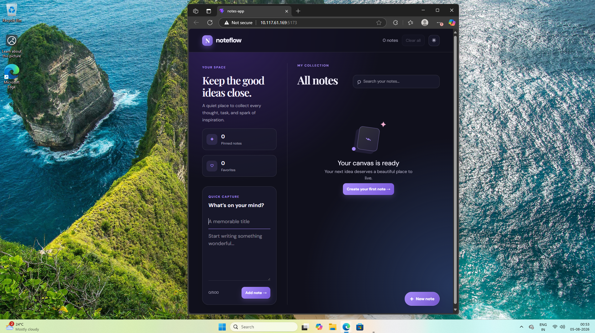
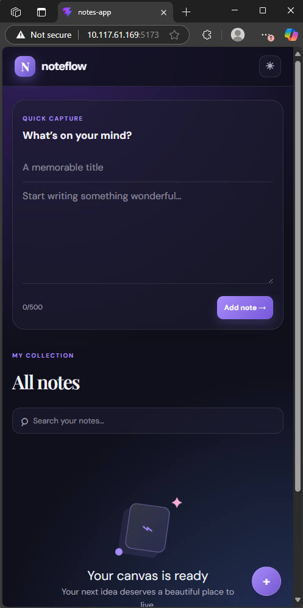

# 📝 Notes App

A modern and responsive Notes App built with **React**. Easily create, edit, search, pin, favorite, and organize your notes with a clean and intuitive interface.

## ✨ Features

- 📝 Create, Edit & Delete Notes
- 🔍 Real-Time Search
- 📌 Pin & ❤️ Favorite Notes
- 🌙 Dark / Light Theme
- 💾 LocalStorage Persistence
- 📱 Fully Responsive Design

## 🛠️ Tech Stack

- React
- JavaScript (ES6+)
- Tailwind CSS
- Vite

## 🚀 Getting Started

```bash
npm install
npm run dev
```

## 📸 Screenshots

### ➕ Add Note


### 📋 All Notes


### 🔍 Search Notes


### 🎨 Theme Toggle


### 💻 Desktop View


### 📱 Mobile View


## 📄 License

This project is licensed under the MIT License.
